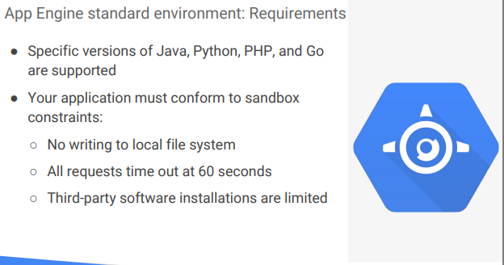

# Course:  Google Cloud Platform Fundamentals: Core Infrastructure
## 
### Cloud Storage

Let's start with Google Cloud Storage. What's object storage? It's not the same as file storage, in which you manage your data as a hierarchy of folders. It's not the same as block storage, in which your operating system manages your data as chunks of disk. Instead, object storage means you save to your storage here, you keep this arbitrary bunch of bytes I give you and the storage lets you address it with a unique key. That's it. Often these unique keys are in the form of URL's which means object storage interacts nicely with Web technologies. Cloud Storage works just like that, except better. It's a fully managed scalable service that means that you don't need to provision capacity ahead of time. Just make objects and the service stores them with high durability and high availability. You can use Cloud Storage for lots of things serving website content, storing data for archival and disaster recovery, or distributing large data objects to your end users via Direct Download. Cloud Storage is not a file system because each of your objects in Cloud Storage has a URL. Each feels like a file in a lot of ways and that's okay to use the word file informally to describe your objects but still it's not a file system. You would not use Cloud Storage as the root file system of your Linux box instead Cloud Storage is comprised of buckets you create and configure and use to hold your storage objects. The storage objects are immutable, which means that you do not edit them in place but instead you create new versions. Cloud Storage always encrypts your data on the server side before it is written to disk and you don't pay extra for that. Also by default, data in-transit is encrypted using HTTPS. Speaking of transferring data, there are services you can use to get large amounts of data into Cloud Storage conveniently. We'll discuss them later in this module. Once they are in Cloud Storage, you can move them onwards to other GCP storage services. Just as I discussed, your Cloud Storage files are organized into buckets. When you create a bucket, you give it a globally unique name. You specify a geographic location where the bucket and its contents are stored and you choose a default storage class. Pick a location that minimizes latency for your users. In other words, if most of your users are in Europe, you probably want to pick a European location. Speaking of your users, there are several ways to control access to your objects and buckets. For most purposes, Cloud IAM is sufficient. Roles are inherited from project to bucket to object. If you need finer control, you can create access control lists ACLs that offer finer control. ACLs define who has access to your buckets and objects as well as what level of access they have. Each ACL consists of two pieces of information, a scope which defines who can perform the specified actions, for example, a specific user or group of users and a permission which defines what actions can be performed. For example, read or write. Remember I mentioned that Cloud Storage objects are immutable. You can turn on object versioning on your buckets if you want. If you do, Cloud Storage keeps a history of modifications that is, it overrides or deletes all of the objects in the bucket. You can list the archived versions of an object, restore an object to an older state or permanently delete a version as needed. If you don't turn on object versioning, new always overrides old. What if versioning sounds good to you but you're worried about junk accumulating? Cloud Storage also offers life-cycle management policies. For example, you could tell Cloud Storage to delete objects older than 365 days. Or you could tell it to delete objects created before January 1, 2013 or keep only the three most recent versions of each object in a bucket that has versioning enabled.

## GC Bigtable
Cloud Bigtable is Google's NoSQL well, big data database service. What is NoSQL mean? Well, this isn't a database course, so I'll give you a very informal picture. Think first of a relational database as offering you tables in which every row has the same set of columns, and the database engine enforces that rule and other rules you specify for each table. That's called the database schema. An enforce schema is a big help for some applications and a huge pain for others. Some applications call for a much more flexible approach. For example, a NoSQL schema. In other words, for these applications not all the rows might need to have the same columns. And in fact, the database might be designed to take advantage of that by sparsely populating the rows. That's part of what makes a NoSQL database what it is. Which brings us to Bigtable. Your databases in Bigtable are sparsely populated tables that can scale to billions of rows and thousands of columns allowing you to store petabytes of data. GCP fully manages the surface, so you don't have to configure and tune it. It's ideal for data that has a single lookup key. Some applications developers think of Bigtable as a persistent hatch table. Cloud Bigtable is ideal for storing large amounts of data with very low latency. It supports high throughput, both read and write, so it's a great choice for both operational and analytical applications including Internet of Things, user analytics and financial data analysis. Cloud Bigtable is offered through the same open source API as HBase, which is the native database for the Apache Hadoop project. I'll talk more about Hadoop later in the course. Anyway, having the same API enables portability of applications between HBase and Bigtable. Given that you could manage your own Apache HBase installation, you might ask yourself, why should I choose Bigtable? Here are a few reasons why you might. First, scalability. If you manage your own Hbase installation, scaling past a certain rate of queries per second is going to be tough, but with Bigtable you can just increase your machine count which doesn't even require downtime. Also, Cloud Bigtable handles administration tasks like upgrades and restarts transparently. All data in Cloud Bigtable is encrypted in both in-flight and at rest. You can even use IAM permissions to control who has access to Bigtable data. One last reference point, Bigtable is actually the same database that powers many of Google's core services including search, analytics, maps and Gmail. As Cloud Bigtable is part of the GCP ecosystem, it can interact with other GCP services and third-party clients. From an application API perspective, data can be read from and written to Cloud Bigtable through a data service layer like Managed VMs, the HBase rest server or a Java server using the HBase client. Typically, this will be to serve data to applications, dashboards and data services. Data can also be streamed in through a variety of popular stream processing frameworks, like Cloud Dataflow Streaming, Spark Streaming and Storm. If streaming is not an option, data can also be read from and written to Cloud Bigtable through batch processes like Hadoop map reduce, Dataflow or Spark. Often summarized or newly calculated data is written back to Cloud Bigtable or to a downstream database.


## GC SQL and GC Spanner
A moment ago, I discussed NoSQL databases. Now, let's turn our attention to relational database services. Remember, these services use a database schema to help your application keep your data consistent, and correct. A moment ago, I discussed NoSQL databases. Now, let's turn our attention to relational database services. Remember, these services use a database schema to help your application keep your data consistent and correct. Another feature of relational database services that helps with the same goal, transactions. Your application can designate a group of database changes as all or nothing. Either they all get made, or none do. Without database transactions, your online bank wouldn't be able to offer you the ability to move money from one account to another. What if, after subtracting $10,000 from one of your accounts, some glitch prevented it from adding that 10,000 to the destination account. Your bank would have just misplaced $10,000. Classically, relational databases are a lot of work to set up, maintain, manage, and administer. If that doesn't sound like a good use of your time but you still want the protections of a relational database, consider CloudSQL. It offers you your choice of the MySQL or PostgreSQL database engines as a fully managed service. CloudSQL offers both MySQL and PostgreSQL databases that are capable of handling terabytes of storage. As of this recording, CloudSQL for PostgreSQL is in beta. So, check the website for details of its status. Of course, you could always run your own database server inside a compute engine virtual machine which a lot of GCP customers do. But there are some benefits of using the CloudSQL managed service instead. First, CloudSQL provide several replica services like read, failover, and external replicas. This means that if an outage occurs, CloudSQL can replicate data between multiple zones with automatic failover. CloudSQL also helps you backup your data with either On-Demand or scheduled backups. It can also scale both vertically by changing the machine type, and horizontally via read replicas. From a security perspective, CloudSQL instances include, network firewalls, and customer data is encrypted when on Google's internal networks, and when stored in database tables, temporary files, and backups. Another benefit of CloudSQL instances, is they are accessible by other GCP services and even external services. You can authorize compute engine instances for access CloudSQL instances and configure the CloudSQL instance to be in the same zone as your virtual machine. CloudSQL also supports other applications and tools that you might be used to like SQL WorkBench, Toad, and other external applications using standard MySQL drivers. If CloudSQL does not fit your requirements because you need horizontal scale ability, consider using Cloud Spanner. It offers transactional consistency at a global scale, schemas, SQL, and automatic synchronous replication for high availability. And, it can provide pedabytes of capacity. Consider using Cloud Spanner if you have outgrown any relational database, or sharding your databases for throughput high performance, need transactional consistency, global data and strong consistency, or just want to consolidate your database. Natural use cases include, financial applications, and inventory applications.

## GC Datastore
We already discussed one, GCP NoSQL database service Cloud Bigtable. Another highly scalable NoSQL database choice for your applications is Cloud Datastore. One of its main use cases is to store structured data from App Engine apps. You can also build solutions that span App Engine and compute engine with Cloud Datastore as the integration point. As you would expect from a fully managed service, Cloud Datastore automatically handles sharding and replication, providing you with a highly available and durable database that scales automatically to handle load. Unlike Cloud Bigtable, it also offers transactions that affect multiple database rows, and it lets you do SQL-like queries. To get you started, Cloud Datastore has a free daily quota that provides storage, reads, writes, deletes and small operations at no charge.

## Comparing Storage Options

Now that we've covered GCPs core storage options, let's compare them to help you choose the right service for your application or workflow. This table focuses on the technical  differentiators of the storage services. Each row has a technical specification and each column is a service. Let me cover each service from left to right. Consider using Cloud Datastore if you need to store unstructured objects or if you require support for transactions and SQ like queries. This storage services provides terabytes of capacity with a maximum unit size of one megabyte per entity. Consider using Cloud Bigtable if you need to store a large amount of structured objects. Cloud Bigtable does not support SQL's queries nor does it support multi-row transactions. This storage service provides petabytes of capacity with a maximum unit size of 10 megabytes per cell and 100 megabytes per row. Consider using Cloud Storage if you need to store immutable blobs larger than 10 megabytes such as large images or movies. This storage service provides petabytes of capacity with a maximum unit size of five terabytes per object. Consider using Cloud SQL or Cloud Spanner if you need full SQL support for an online transaction processing system. Cloud SQL provides terabytes of capacity, while Cloud Spanner provides petabytes. If Cloud SQL does not fit your requirements because you need horizontal scalability not just through the replicas, consider using Cloud Spanner. We didn't cover BigQuery in this module as it sits on the edge between data storage and data processing, but you will learn more about it in the Big Data and Machine Learning in the Cloud Module. The usual reason to store data in BigQuery is to use its big data analysis and interactive query and capabilities. You would not want to use BigQuery for example as the backings store for an online application. Considering the technical differentiators of the different storage services, help some people decide which storage service to choose. Others like to consider use cases. Let me go through each service one more time. Cloud Datastore is the best for semi-structured application data that is used in app engines applications. Bigtable is best for analytical data with heavy read write events like AdTech, Financial or IoT data. Cloud Storage is best for structured and unstructured, binary or object data like images, large media files and backups.SQL is best for web frameworks and in existing applications like storing user credentials and customer orders. Cloud Spanner is best for large scale database applications that are larger than two terabytes, for example, for financial trading and e-commerce use cases. As I mentioned at the beginning of the module, depending on your application, you might use one or several of these services to get the job done.

## Containers, Kubernetes, and Kubernetes Engine
In this module, you've learned how to build a run containerized applications, orchestrate and scale them on a cluster, and deploy them using roll-outs.

- no subtitles

### Exercise
Start a Kubernetes cluster managed by Kubernetes Engine. Name the cluster webfrontend and configure it to run 2 nodes:

`gcloud container clusters create webfrontend --zone $MY_ZONE --num-nodes 2`

It takes several minutes to create a cluster as Kubernetes Engine provisions virtual machines for you.

After the cluster is created, check your installed version of Kubernetes using the kubectl version command:

`kubectl version`

The gcloud container clusters create command automatically authenticated kubectl for you.

Check running VM Instances: Compute Engine > VM Instances.

From your Cloud Shell prompt, launch a single instance of the nginx container. (Nginx is a popular web server.)

`kubectl run nginx --image=nginx:1.10.0`

In Kubernetes, all containers run in pods. This use of the kubectl run command caused Kubernetes to create a deployment consisting of a single pod containing the nginx container. A Kubernetes deployment keeps a given number of pods up and running even in the event of failures among the nodes on which they run. In this command, you launched the default number of pods, which is 1.

View the pod running the nginx container:

`kubectl get pods`

Expose the nginx container to the Internet:

`kubectl expose deployment nginx --port 80 --type LoadBalancer`

Kubernetes created a service and an external load balancer with a public IP address attached to it. The IP address remains the same for the life of the service. Any network traffic to that public IP address is routed to pods behind the service: in this case, the nginx pod.

View the new service:

`kubectl get services`

You can use the displayed external IP address to test and contact the nginx container remotely.

It may take a few seconds before the ExternalIP field is populated for your service. This is normal. Just re-run the kubectl get services command every few seconds until the field is populated.

Open a new web browser tab and paste your cluster's external IP address into the address bar. The default home page of the Nginx browser is displayed.

Scale up the number of pods running on your service:

`kubectl scale deployment nginx --replicas 3`

Scaling up a deployment is useful when you want to increase available resources for an application that is becoming more popular.

Confirm that Kubernetes has updated the number of pods:

`kubectl get pods`

Confirm that your external IP address has not changed:

`kubectl get services`

Return to the web browser tab in which you viewed your cluster's external IP address. Refresh the page to confirm that the nginx web server is still responding.

##  Introduction to App Engine

So we've discussed two GCP products that provide the compute infrastructure for applications: compute engine and Kubernetes engine. What these have in common is that you choose the infrastructure in which your application runs. Based on virtual machines for compute engine and containers for Kubernetes engine. But what if you don't want to focus on the infrastructure at all? You just want to focus on your code. That's what App Engine is for. I'll tell you more about it in this module. Let's start with PaaS. Recall that a PaaS is a platform as a service. The App Engine platform manages the hardware and networking infrastructure required to run your code. To deploy an application on App Engine, you just hand app engineer code and the App Engine service takes care of the rest. App Engine provides you with a built-in services that many web applications need. No SQL database, in-memory caching, load balancing, health checks, logging and a way to authenticate users. You code your application to take advantage of these services and App Engine provides them. App engine will scale your application automatically in response to the amount of traffic it receives. So you only pay for those resources you use. There are no servers for you to provision or maintain. That's why App Engine is especially suited for applications where the workload is highly variable or unpredictable like web applications and mobile backend. App Engine offers two environments, standard and flexible. I'll explain what each is and how to choose.

## Google App Engine Standard Environment

Of the two App Engine Environments, Standard is the simpler. It offers a simpler deployment experience than the Flexible environment and fine grained auto-scaling. Like the Standard Environment, it also offers a free daily usage quota for the use of some services. What's distinctive about the Standard Environment though, is that low utilization applications might be able to run at no charge. Google provides App Engine software development kits in several languages. So that you can test your application locally before you upload it to the real App Engine service. The SDKs also provide simple commands for deployment. Now, you may be wondering what does my code actually run on? I mean what exactly is the executable binary? App Engine's term for this kind of binary is the runtime. In App Engine Standard Environment, you use a runtime provided by Google. We'll see your choices shortly. App Engine Standard Environment provides runtimes for specific versions of Java, Python, PHP and Go. The runtimes also include libraries that support App Engine APIs. And for many applications, the Standard Environment runtimes and libraries may maybe all you need. If you want to code in another language, Standard Environment is not right for you. You want to consider the Flexible Environment. 

The Standard Environment also enforces restrictions on your code by making it run in a so-called Sandbox. That's a software construct that's independent of the hardware, operating system, or physical location of the server it runs on. The Sandbox is one of the reasons why App Engine Standard Environment can scale and manage your application in a very fine grained way. Like all Sandboxes, it imposes some constraints. For example, your application can't write to the local file system. It'll have to write to a database service instead if it needs to make data persistent. Also, all the requests your application receives has a 60-second timeout, and you can't install arbitrary third party software. If these constraints don't work for you, that would be a reason to choose the Flexible Environment. 

Here's a diagram of how you'll use App Engine Standard Environment in practice. You'll develop your application and run a test version of it locally using the App Engine SDK. Then when you're ready, you'll use the SDK to deploy it. Each App Engine application runs in a GCP project. App Engine automatically provisions server instances and scales and load balances them. Meanwhile, your application can make calls to a variety of services using dedicated APIs. Here are a few examples. A NoSQL data store to make data persistent, caching of that data using Memcache, searching user logging, and the ability to launch actions not triggered by direct user requests like task queues and a task scheduler.

##  App Engine Flexible Environment
Suppose you've decided that the restrictions of App Engine standard environments sandbox model don't work for you, but you still want to take advantage of the benefits of App Engine. That's what App Engine flexible environment is for. Instead of the sandbox, App Engine flexible environment lets you specify the container your app engine runs in. Yes, containers, your application runs inside Docker containers on Google Compute Engine Virtual Machines, VMs. App engine manages these compute engine machines for you. Their health checked, healed as necessary, and you get to choose which geographical region they run in, and critical backward compatible updates to their operating systems are automatically applied. All this so that you can just focus on your code. App Engine flexible environment apps use standard run times, can access App Engine services such as data store, memcached, task queues, and so on. Here's a side by side comparison of standard and flexible. Notice that standard environment starts up instances of your application faster, but that you get less access to the infrastructure in which your application runs. For example, flexible environment lets you SSH into the virtual machines on which your application runs. It lets you use local disk for scratch base, it lets you install third-party software, and it lets your application make calls to the network without going through App Engine. On the other hand, standard environments building can drop to zero for the completely idle application. Because we mentioned app engines use of Docker containers, you may be wondering how App Engine compares to Kurbenetes Engine. Here's a side-by-side comparison of App Engine with Kurbenetes Engine. App Engine standard environment is for people who want the service to take maximum control of their applications deployment and scaling. Kurbenetes Engine gives the application owner the full flexibility of Kurbenetes. App Engine flexible edition is somewhere in between. Also, App Engine environment treats containers as a means to an end, but for Kurbenetes Engine, containers are fundamental organizing principle.


## Google Cloud Endpoints and Apigee Edge
I've mentioned Application Programming Interfaces, APIs, several times in this course. Let's be precise about what an API is. A software services implementation can be complex and changeable. What if to use that service, other pieces of software had to know internal details about how they worked? That would be a mess. So instead application developers structure the software they write so that it presents a clean, well-defined interface that abstracts away needless details and then they document that interface. That's an API. The underlying implementation can change as long as the interface doesn't and other pieces of software that use the API don't have to know or care. Sometimes you have to change an API, say to add or deprecate a feature. To make this kind of API change cleanly, developers version their APIs. Version two of an API might contain calls that version one does not. Programs that consume the API can specify the API version that they want to use in their calls. Supporting an API is very important task and Google Cloud platform provides two API management tools. They approach related problems in a different way and each has a particular strength. Suppose you're developing a software service and one of GCP's backends, you'd like to make it easy to expose this API, you'd like to make sure it's only consumed by other developers whom you trust, you'd like an easy way to monitor and log its use, you'd like for the API to have a single coherent way for it to know which end user is making the call. That's when you use Cloud Endpoints. It implements these capabilities and more using an easy to deploy proxy in front of your software service, and it provides an API console to wrap up those capabilities in an easy to manage interface. Cloud Endpoints supports applications running in GCPs compute platforms in your choice of languages and your choice of client technologies. Apigee Edge is also a platform for developing and managing API proxies. It has a different orientation though. It has a focus on business problems like rate limiting, quotas, and analytics. Many users of Apigee Edge are providing a software service to other companies and those features come in handy. Because of the backend services for Apigee Edge need not be in GCP, engineers often use it when they are taking apart a legacy application. Instead of replacing a monolithic application in one risky move, they can instead use Apigee Edge to peel off its services one by one, standing up micro services to implement each in turn until the legacy application can be finally retired.

### Google Cloud Endpoints and Apigee Edge
I've mentioned Application Programming Interfaces, APIs, several times in this course. Let's be precise about what an API is. A software services implementation can be complex and changeable. What if to use that service, other pieces of software had to know internal details about how they worked? That would be a mess. So instead application developers structure the software they write so that it presents a clean, well-defined interface that abstracts away needless details and then they document that interface. That's an API. The underlying implementation can change as long as the interface doesn't and other pieces of software that use t`he API don't have to know or care. Sometimes you have to change an API, say to add or deprecate a feature. To make this kind of API change cleanly, developers version their APIs. Version two of an API might contain calls that version one does not. Programs that consume the API can specify the API version that they want to use in their calls. Supporting an API is very important task and Google Cloud platform provides two API management tools. They approach related problems in a different way and each has a particular strength. Suppose you're developing a software service and one of GCP's backends, you'd like to make it easy to expose this API, you'd like to make sure it's only consumed by other developers whom you trust, you'd like an easy way to monitor and log its use, you'd like for the API to have a single coherent way for it to know which end user is making the call. That's when you use Cloud Endpoints. It implements these capabilities and more using an easy to deploy proxy in front of your software service, and it provides an API console to wrap up those capabilities in an easy to manage interface. Cloud Endpoints supports applications running in GCPs compute platforms in your choice of languages and your choice of client technologies. Apigee Edge is also a platform for developing and managing API proxies. It has a different orientation though. It has a focus on business problems like rate limiting, quotas, and analytics. Many users of Apigee Edge are providing a software service to other companies and those features come in handy. Because of the backend services for Apigee Edge need not be in GCP, engineers often use it when they are taking apart a legacy application. Instead of replacing a monolithic application in one risky move, they can instead use Apigee Edge to peel off its services one by one, standing up micro services to implement each in turn until the legacy application can be finally retired.


### Exercise Guestbook
```
git clone https://github.com/GoogleCloudPlatform/appengine-guestbook-python
cd appengine-guestbook-python
cat app.yaml
dev_appserver.py ./app.yaml
gcloud app deploy ./index.yaml ./app.yaml
``` 
#### Preview an App Engine application
On the Google Cloud Platform menu, click Activate Google Cloud Shell Activate Cloud Shell. If a dialog box appears, click Start Cloud Shell.

Clone the source code repository for a sample application called guestbook:

`git clone https://github.com/GoogleCloudPlatform/appengine-guestbook-python`

Navigate to the source directory:

`cd appengine-guestbook-python`

View the app.yaml file and note its structure:

`cat app.yaml`

YAML is a templating language. YAML files are used for configuration of many Google Cloud Platform services, although the valid objects and specific properties vary with the service. This file is an App Engine YAML file with handlers: and libraries:. A Cloud Deployment Manager YAML file, for example, would have different objects.

Run the application using the built-in App Engine development server.

`dev_appserver.py ./app.yaml`

The App Engine development server is now running the guestbook application in the local Cloud Shell. It is using other development tools, including a local simulation of Datastore.

In Cloud Shell, click Web preview Web Preview > Preview on port 8080 to preview the application.

To access the Web preview icon, you may need to collapse the Navigation menu.

Try the application. Make a few entries in Guestbook, and click Sign Guestbook after each entry.

Using the Google Cloud Platform Console, verify that the app is not deployed. In the GCP Console, on the Navigation menu(Navigation menu), click App Engine > Dashboard. Notice that no resources are deployed. The App Engine development environment is local.

To end the test, return to Cloud Shell and press Ctrl+C to abort the App Engine development server.

#### Deploy the Guestbook application to App Engine
Ensure that you are at the Cloud Shell command prompt.

Deploy the application to App Engine using this command:

`gcloud app deploy ./index.yaml ./app.yaml`

If prompted for a region, enter the number corresponding to the region that Qwiklabs or your instructor assigned you to. Type Y to continue.

To view the startup of the application, in the GCP Console, on the Navigation menu(Navigation menu), click App Engine > Dashboard.

You may see messages about "creating your first app". Keep refreshing the page periodically until the application is deployed.

View the application on the Internet. The URL for your application is `https://PROJECT_ID.appspot.com/` where `PROJECT_ID` represents your Google Cloud Platform project name. This URL is listed in two places:

The output of the deploy command: Deployed service [default] to [https://PROJECT_ID.appspot.com]
The upper-right pane of the App Engine Dashboard
Copy and paste the URL into a new browser window.

You may see an INTERNAL SERVER ERROR. If you read to the bottom of the page, you will see that the error is caused because the Datastore Index is not yet ready. This is a transient error. It takes some time for Datastore to prepare and begin serving the Index for guestbook. After a few minutes, you will be able to refresh the page and see the guestbook application interface.

Congratulations! You created your first application using App Engine, including exercising the local development environment and deploying it. It is now available on the internet for all users.

#### Disable the application
App Engine offers no option to undeploy an application. After an application is deployed, it remains deployed, although you could instead replace the application with a simple page that says something like "not in service."

However, you can disable the application, which causes it to no longer be accessible to users.

In the GCP Console, on the Navigation menu(Navigation menu), click App Engine > Settings.

Click Disable application.

Read the dialog message. Enter the App ID and click DISABLE

## Development in the cloud

People create great applications in the Google Cloud. Popular tools for development, deployment and monitoring just work in GCP. You also have options for tools that are tightly-integrated with GCP and in this module, I'll explain them. Let's start with talking about development. Lots of GCP customers use Git to store and manage their source code trees. That means, running their own Git instances or using a hosted Git provider. Running your own is great because you have total control. Using a hosted Git provider is great because it's less work. What if there were a third way? Maybe a way to keep code private to a GCP project and use I am permissions to protected but not have to maintain the Git instance yourself. That's what Cloud Source repositories is. It provides Git version control to support your team's development of any application or service, including those that run on App Engine, compute engine, and Kubernetes engine. With Cloud Source repositories, you can have any number of private Git repositories, which allows you to organize the code associated with your cloud project in whatever way works best for you. Cloud Source repositories also contains a source viewer so that you can browse and view repository files from within the GCP console. Many applications contain event-driven parts. For example, maybe you have an application that lets users upload images. Whenever that happens, you need to process that image in various ways. Convert it to a standard image format, thumbnail into various sizes, and store each in a repository. You could always integrate this function into your application, but then you have to worry about providing compute resources for it no matter whether it happens once a day or once a millisecond. What if you could just make that provisioning problem go away? It would be great if you could write a single purpose function that did the necessary image manipulations and then arrange for it to automatically run whenever a new image gets uploaded. That's exactly what cloud functions lets you do. You don't have to worry about servers or runtime binaries. You just write your code in JavaScript for a Node.js environment that GCP provides and then configure when it should fire. There's no need for you to pay for servers either. You just pay whenever your functions run in 100 millisecond intervals. Cloud functions can trigger on events in cloud storage, Cloud Pub/Sub, or in HTTP call. Here's how setting up a cloud function works. You choose which events you care about. For each event type, you tell cloud functions you're interested in it. These declarations are called triggers. Then you attach JavaScript functions to your triggers. From now on, your functions will respond whenever the events happen. Some applications, especially those that have microservices architecture can be implemented entirely in cloud functions. People also use cloud functions to enhance existing applications without having to worry about scaling.

Monitoring: Proactive instrumentation

You can't run an application stably without monitoring. Monitoring lets you figure out whether the changes you made were good or bad. It lets you respond with information rather than with panic, when one of your end users complains that your application is down. `Stackedriver` is GCP's tool for monitoring, logging and diagnostics. Stackdriver gives you access to many different kinds of signals from your Infrastructure platforms, virtual machines, containers, middleware and application tier, logs, metrics and traces. It gives you insight into your application's health, performance and availability. So if issues occur, you can fix them faster. Here are the core components of Stackdriver: Monitoring, Logging, Trace, Error Reporting and debugging. Stackdriver monitoring checks the endpoints of Web applications and other Internet accessible services running on your cloud environment. You can configure uptime checks associated with URLs, groups or resources such as Instances and load balancers. You can set up alerts on interesting criteria, like when health check results or up times fall into levels that need action. You can use monitoring with a lot of popular notification tools. And you can create dashboards to help you visualize the state of your application. Stackdriver logging lets you view logs from your applications and filter and search on them. Logging also lets you define metrics, based on log contents that are incorporated into dashboards and alerts. You can also export logs to BigQuery, Cloud Storage and Cloud PubSub. Stackdriver error reporting tracks and groups the errors in your cloud applications. And it notifies you when new errors are detected. With Stackdriver trace, you can sample the latency of app engine applications and report Per-URL statistics. How about debugging? A painful way to debug an existing application, is to go back into it and add lots of logging statements. Stackdriver debugger offers a different way. It connects your applications production data to your source code. So you can inspect the state of your application at any code location in production. That means you can view the application stage without adding logging statements. Stackdriver Debugger works best when your application source code is available, such as in Cloud Source repositories. Although it can be in other repositories too.

## Introduction to Big Data and Machine Learning

Google believes that in the future, every company will be a data company. Because making the fastest and best use of data is a critical source of competitive advantage. Google Cloud provides a way for everybody to take advantage of Google's investments in infrastructure and data processing innovation. Google Cloud has automated out the complexity of building and maintaining data and analytics systems. In this module, I'll tell you about Google's technologies for getting the most out of data fastest. Whether it's real time analytics or machine learning. These tools are intended to be simple and practical for you to embed in your applications so that you can put data into the hands of your domain experts and get insights faster.


### Google Cloud Big Data Platform

Google Cloud Big Data Solutions are designed to help you transform your business and user experiences with meaningful data insights. We like to call it an Integrated Serverless Platform. What does that mean? Serverless means you don't have to worry about provisioning compute instances to run your jobs. The services are fully managed, and you pay only for the resources you consume. The platform is integrated, so that GCP data services work together to help you create custom solutions. Apache Hadoop is an open source framework for big data. It is based on the MapReduce programming model which Google invented and published. The MapReduce model is, at its simplest, means that one function traditionally called the Map function, runs in parallel with a massive dataset to produce intermediate results. And another function, traditionally called the reduce function, builds a final result set based on all those intermediate results. The term Hadoop is often used informally to encompass Apache Hadoop itself, and related projects such as Apache Spark, Apache Pig, and Apache Hive. 

Cloud Dataproc is a fast, easy, managed way to run Hadoop, Spark, Hive, and Pig on Google Cloud Platform. All you have to do is request a Hadoop cluster. It will be built for you in 90 seconds or less, on top of Compute Engine virtual machines whose number and type you control. If you need more or less processing power while your cluster is running, you can scale it up or down. You can use the default configuration for the Hadoop software in your cluster or you can customize it. And you can monitor your cluster using Stackdriver. Running on-premises, Hadoop jobs requires a capital hardware investment. Running these jobs in Cloud Dataproc, allows you to only pay for hardware resources used during the life of the cluster you create. Although the rate for pricing is based on the hour, Cloud Dataproc is built by the second. Our Cloud Dataproc clusters are build in one second clock time increments. Subject to a one minute minimum billing. So, when you're done with your cluster, you can delete it, and billing stops. This is much more agile use of resources than on-premise hardware assets. You can also save money, by telling Cloud Dataproc to use preemptible compute engine instances for your batch processing. You have to make sure that your jobs can be restarted cleanly, if they're terminated, and you get a significant break in the cost of the instances. At the time this video was made, preemptible instances were around 80 percent cheaper. Be aware that the cost of the compute engine instances isn't the only component of the cost of a Dataproc cluster, but it's a significant one. Once your data is in a cluster, you can use Spark and Spark SQL to do data mining. And you can use MLib, which is Apache Spark's machine learning libraries to discover patterns through machine learning.

### Cloud Dataflow

Cloud Dataproc is great when you have a data set of known size or when you want to manage your cluster size yourself. But what if your data shows up in real time or it's of unpredictable size or rate? That's where Cloud Dataflow is particularly good choice. 

It's both a unified programming model and a managed service and it lets you develop and execute a big range of data processing patterns; extract, to transform, and load batch computation and continuous computation. You use Dataflow to build data pipelines. And the same pipelines work for both batch and streaming data. There's no need to spin up a cluster or to size instances. Cloud Dataflow fully automates the management of whatever processing resources are required. Cloud Dataflow frees you from operational tasks like resource management and performance optimization. 

In this example, Dataflow pipeline reads data from a big query table, the source. Processes it in a variety of ways, the transforms. And writes it's output to a cloud storage, the Sync. Some of those transforms you see here are map operations and some or reduce operations. You can build really expressive pipelines. Each step in the pipeline is elastically scaled. There is no need to launch and manage a cluster. Instead, the service provides all resources on demand. It has automated and optimized worked partitioning built-in which can dynamically re-balance lagging work that reduces the need to worry about hotkeys. That is situations where just proportionately large chunks of your input get mapped to the same cluster. People use Dataflow in a variety of use cases. As we've discussed, it's a general purpose ETL tool and its use case as a data analysis engine comes in handy in things like fraud detection and financial services, IoT analytics in manufacturing, healthcare and logistics and click stream, point of sale and segmentation analysis in retail. And because those pipelines, we saw can orchestrate multiple services even external services. It can be used in real time applications such as personalizing gaming user experiences.

### BigQuery
Suppose, instead of a dynamic pipeline, your data needs to run more in the way of exploring a vast sea of data. You want to do ad hoc SQL queries on a massive data set. That's what BigQuery is for. It's Google's *fully manage petabyte scale, low cost analytics data warehouse*. Because there's no infrastructure to manage, you can focus on analyzing data to find meaningful insights. Use familiar SQL and take advantage of our pay-as-you-go model. It's easy to get data into BigQuery. You can load it from cloud storage or cloud data store, or stream it into Big Query at up to 100,000 rows per second. Once it's in there, you can run super fast SQL queries against multiple terabytes of data in seconds using the processing power of Google's infrastructure. In addition to SQL queries, you can easily read and write data in BigQuery via Cloud Dataflow, Hadoop, and Spark. BigQuery is used by all types of organizations from startups to Fortune 500 companies, smaller organizations like Big Query's free monthly quotas, bigger organizations like its seamless scale, and it's available 99.9 percent service level agreement. Google's infrastructure is global and so is BigQuery. BigQuery lets you specify the region where your data will be kept. So, for example, if you want to keep data in Europe, you don't have to go set-up a cluster in Europe. Just specify the EU location where you create your data set. US and Asia locations are also available. Because BigQuery separates storage and computation, you pay for your data storage separately from queries. That means, you pay for queries only when they are actually running. You have full control over who has access to the data stored in BigQuery, including sharing data sets with people in different projects. If you share data sets that won't impact your cost or performance, people you share with pay for their own queries, not you. Long term storage pricing is an automatic discount for data residing in BigQuery for extended periods of time. When the age of your data reaches 90 days in BigQuery, Google will automatically drop the price of storage.

### Cloud Pub/Sub and Cloud Datalab

Whenever you're working with events in real time, it helps to have a **messaging service**. That's what Cloud Pub/Sub is. It's meant to serve as *a simple, reliable, scalable foundation for stream analytics*. You can use it to let independent applications you build send and receive messages. That way they're decoupled. So they scale independently. The Pub in Pub/Sub is short for publishers and Sub is short for subscribers. Applications can publish messages in Pub/Sub and one or more subscribers receive them. Receiving messages doesn't have to be synchronous. That's what makes Pub/Sub great for decoupling systems. It's designed to provide at least once delivery at low latency. When we say at least once delivery, we mean that there is a small chance some messages might be delivered more than once. So, keep this in mind when you write your application. Cloud Pub/Sub offers on demand scalability to one million messages per second and beyond. You just choose the quota you want. Cloud Pub/Sub builds on the same technology Google uses internally. It's an important building block for applications where data arrives at high and unpredictable rates like Internet of Things systems. If you're analyzing streaming data, Cloud Dataflow is a natural pairing with Pub/Sub. Pub/Sub also works well with applications built on GCPs compute platforms. You can configure your subscribers to receive messages on a push or pull basis. In other words, subscribers can get notified when new messages arrive for them or they can check for new messages at intervals. 

Scientists have long used lab notebooks to organize their thoughts and explore their data. For data science, the lab notebook metaphor works really well, because it feels natural to intersperse data analysis with comments about their results. A popular environment for hosting those is Project Jupyter. It lets you create and maintain web-based notebooks containing Python code and you can run that code interactively and view the results. And Cloud Datalab takes the management work out of this natural technique. It runs in a Compute Engine virtual machine. To get started, you specify the virtual machine type you want and what GCP region it should run in. When it launches, it presents an interactive Python environment that's ready to use. And it orchestrates multiple GCP services automatically, so you can focus on exploring your data. You only pay for the resources you use. There is no additional charge for Datalab itself. 

It's integrated with BigQuery, Compute Engine, and Cloud Storage, so accessing your data doesn't run into authentication hustles. When you're up and running, you can visualize your data with Google charts or map plot line and because there's a vibrant interactive Python community, you can learn from published notebooks. There are many existing packages for statistics, machine learning, and so on.


### Google Cloud Machine Learning Platform

Machine learning is one branch of the field of artificial intelligence. It's a way of solving problems without explicitly coding the solution. Instead, human coders build systems that improve themselves over time through repeated exposure to sample data which we call training data. Major Google applications use machine learning like YouTube, photos, the Google mobile App and Google translate. The Google Machine Learning Platform is now available as a cloud service so that you can add innovative capabilities to your own applications. Cloud Machine Learning Platform provides modern machine learning services with pre-trained models and a platform to generate your own tailored models. As with other GCP products, there's a range of services that stretches from the highly general to the pre-customized. TensorFlow is an open source software library that's exceptionally well suited for machine learning applications like neural networks. It was developed by Google Brain for Google's internal use and then open source so that the world could benefit. You can run TensorFlow wherever you like but GCP is an ideal place for it because machine learning models need lots of on-demand compute resources and lots of training data. 

TensorFlow can also take advantage of Tensor processing units which are hardware devices designed to accelerate, machine learning workloads with TensorFlow. GCP makes them available in the cloud with compute engine virtual machines. Each cloud TPU provides up to 180 teraflops of performance. And because you pay for only what you use, there's no upfront capital investment required. Suppose you want a more managed service. Google Cloud Machine Learning Engine lets you easily build machine learning models that work on any type of data of any size. It can take any TensorFlow model and perform large scale training on a managed cluster. Finally, suppose you want to add various machine learning capabilities to your applications without having to worry about the details of how they are provided. Google Cloud also offers a range of machine learning APIs suited to specific purposes. And I'll discuss them in a moment. 

People use the Cloud Machine Learning Platform for lots of applications. Generally, they fall into two categories depending on whether the data they work on is structured or unstructured. Based on structured data, you can use ML for various kinds of classification and regression tasks like customer churn analysis, product diagnostics and forecasting. It can be the heart of our recommendation engine for content personalization and cross-sales and up-sells. You can use ML to detect anomalies as in fraud detection, sensor diagnostics or log metrics. Based on unstructured data, you can use ML for image analytics such as identifying damaged shipment, identifying styles and flagging content. You can do text analytics too. Like a call center, blog analysis, language identification, topic classification and sentiment analysis. In many of the most innovative applications for machine learning, several of these kinds of applications are combined. What if whenever one of your customers posted praise for one of your products on social media, your application could automatically reach out to them with a customized discount on another product they'll probably like. The Google Cloud machine Learning Platform makes that kind of interactivity well within your grasp.

### Machine learning APIs

The Cloud [Vision API](https://cloud.google.com/vision/) enables developers to understand the content of an image. It quickly classifies images into thousands of categories, sailboat, lion, Eiffel Tower detects individual objects within images and finds and reads printed words contained within images. Like the other APIs I'm describing here, encapsulates powerful machine learning models behind an easy to use API. You can use it to build meta data on your image catalog, moderate offensive content or even do image sentiment analysis. The cloud [speech API](https://cloud.google.com/speech/) enables developers to convert audio to text because you have an increasingly global user base. The API recognizes over 80 languages and variants. You can transcribe the text of users, dictating in applications microphone, enable command and control through voice or transcribe audio files. The [Cloud Natural Language API](https://cloud.google.com/natural-language/) offers a variety of natural language understanding technologies to developers. It can do syntax analysis, breaking down sentences supplied by our users into tokens, identify the nouns, verbs, adjectives, and other parts of speech and figure out the relationships among the words. It can do entity recognition. In other words, it can parse text and flag mentions of people, organizations, locations, events, products, and media. It can understand the overall sentiment expressed in a block of text. It has these capabilities in multiple language, including English, Spanish, and Japanese. [Cloud translation API](https://cloud.google.com/translate/) provides a simple, programmatic interface for translating an arbitrary string into a supported language. When you don't know the source language, the API can detect it. The [Cloud Video Intelligence API](https://cloud.google.com/video-intelligence/) lets you annotate videos in a variety of formats. It helps you identify key entities that is nouns within your video and when they occur. You can use it to make video content searchable and discoverable. At the time this video was produced, the Cloud Video Intelligence Service was in beta. So, check the GCP website for updates.

## Review
In this short module, I look back on what we covered in this course. Remember the continuum that this course discussed at the very beginning. The continuum between managed infrastructure and dynamic infrastructure. GCP's compute services are arranged along this continuum, and you can choose where you want to be on it. Choose Compute Engine if you want to deploy your application in virtual machines that run on Google's infrastructure. Choose Kubernetes Engine if you want instead to deploy your application in containers that run on Google's infrastructure. In a Kubernetes cluster you're defining control. Choose App Engine instead if you just want to focus on your code, leaving most infrastructure and provisioning to Google. App Engine flexible environment lets you use any run time you want, and gives you full control of the environment in which your application runs. App Engine standard environment lets you choose from a set of standard run times and offers finer grain scaling and scaled Azira. To completely relieve yourself from the chore of managing infrastructure, build or extend your application using Cloud Functions. You supply chunks of code for business logic, and your code get spun up on demand in response to events. GCP offers a variety of ways to load balance in bound traffic. Use Global HTTPS load balancing to put your Web application behind a single anycast IP to the entire Internet. It load balances traffic among all your back-end instances in regions around the world. And it's integrated with GCP's Content Delivery Network. If your traffic isn't HTTP or HTTPS, you can use the global TCP or SSL Proxy for traffic on many ports. For other ports or for UDP traffic, use the regional load balancer. Finally, to load balance the internal tiers of multi-tier application, use the internal load balancer.

GCP also offers a variety of ways for you to interconnect your On-premises or other cloud networks with your Google VPC. It's simple to set up a VPN and you can use cloud router to make it dynamic. You can also peer with Google, edits many worldwide points of presence either directly or through a carrier partner. Or if you need a service level agreement and can adopt one of their required network typologies, use Dedicated Interconnect. Consider using Cloud datastore if you need to store structured objects, or if you require support for transactions and SQL-like queries. Consider using Cloud Bigtable if you need to store a large amount a single key data, especially structured objects. Consider using Cloud Storage if you need to store immutable binary objects. Consider using Cloud SQL or Cloud Spanner if you need full SQL support for an online transaction processing system. Cloud SQL provides terabytes of capacity while Cloud Spanner provides petabytes and horizontal scalability. Consider BigQuery if you need interactive querying in an online analytical processing system with petabytes of scale. I'd like to zoom into one of those services we just discussed, Cloud Storage and remind you of its four storage classes. Multi-regional and regional are the classes for warm and hot data. Use Multi-regional especially for content that's being served to a global Web audience. And use Regional for working storage for compute operations. Nearline and Coldline are the classes for, as you'd guess cooler data. Use Nearline for backups and for infrequently accessed content. And use Codeline for archiving and disaster recovery.