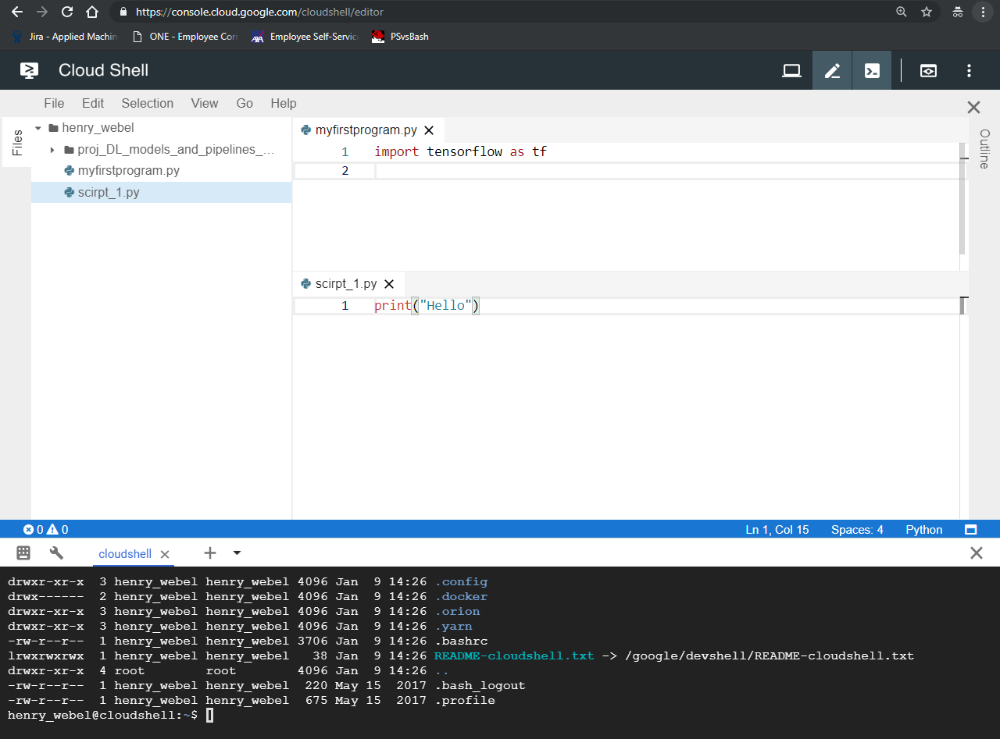

# Working in Console 

## Datalab

## IDE
There is an [Code Editor](https://cloud.google.com/blog/products/gcp/introducing-google-cloud-shels-new-code-editor) available based on [Eclipse Orion](https://github.com/eclipse/orion.client)

> We’ve heard from a lot of Google Cloud Platform (GCP) users that they like to edit code and configuration files without leaving their browser. We're now making that easier by offering a new feature: an integrated code editor.
>
>The new code editor is based on [Eclipse Orion](https://github.com/eclipse/orion.client), and is part of Google Cloud Shell, a command line interface to manage GCP resources. You can access Cloud Shell via the browser from any computer with an internet connection, and it comes with the Cloud SDK and other essential tools pre-installed. The VM backing Cloud Shell is temporary, but each user gets 5GB of persistent storage for files and projects.

- if you need more compute power or persistent storage, connect to Compute VM over ssh.

Try out: [console.cloud.google.com/cloudshell/editor](https://console.cloud.google.com/cloudshell/editor)